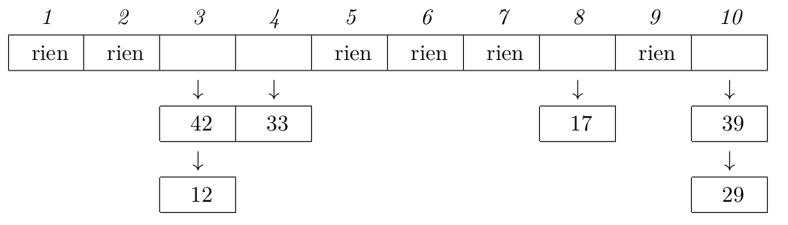

# ALG3

# Hashage
> Transformation d'une information en un entier unique.

## Table de hashage

> On effectue un hashage sur chaque élément et on écrit leur valeur respective à l'adresse correspondant au hash.

## Map<K, T> avec hashage **`h`**

1. On utilise une classe:
```java
Element<K, T> {
    K clef;
    T valeur;
}
```
2. Créer un tableau dont les entrées sont `Element<K, T>`
3. Si on veut stocker une instance **`d`** de `ElementList<K, T>`, je le place en position `h(d.clef)` du tableau.

### Exemple:

Prenons `(777, "Lucky")`<br>
On le place en position `h(777)` en utilisant la fonction de hashage `h(c) = c % 10`<br>
On le place donc en position `7`.<br>

# Collisions

## Technique 1: Adressage ouvert

Avec l'exemple précédent, `(777, "Lucky")` et<br>`(17, "Glycine")` auraient le même hash!
- `h(777) = 7` et `h(17) = 7`

> Alors, on prend `h(17)` mais si c'est occupé, on prend la première case libre en allant vers la droite.

## Supprimer un élément
> Lorsqu'on supprime un élément, on vérifie toutes les autres cases pour les rapprocher de leur case théorique.

Si on supprime `(777, "Lucky")`, alors `(17, "Glycine")` prendrait sa place et tous les autres **`h = 7`** seraient rapprochés d'une case. (On reorganise le tableau)

## Technique 2: Le chaînage

> On remplace le tableau de `Element<K, T>` par un tableau de `LinkedList<Element<K, T>>`

Ainsi, si on veut ajouter `(777, "Lucky")` et `(17, "Glycine")`, Lucky sera ajouté dans la liste en position **`7`** du tableau, et Glycine sera ajouté dans cette même liste à la suite de Lucky.


<p style="color: darkgray; text-align: center">Exemple avec h(c) = c % 10</p>