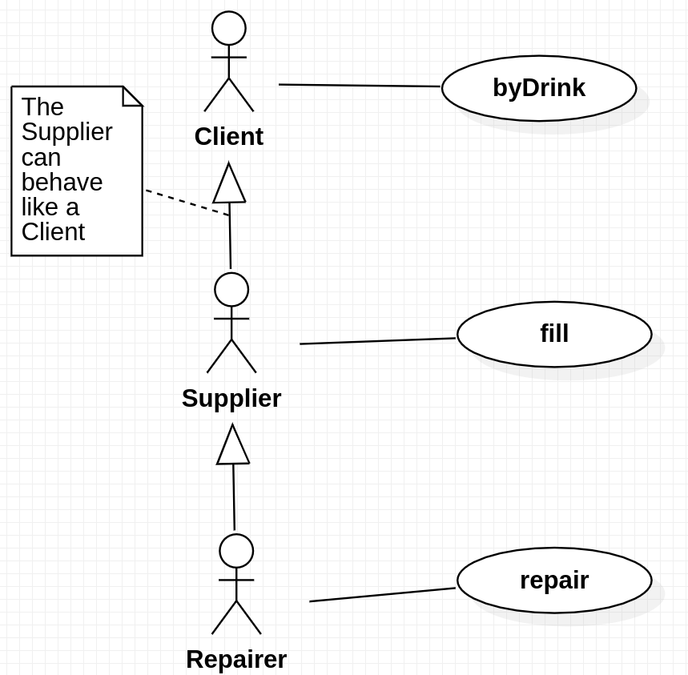
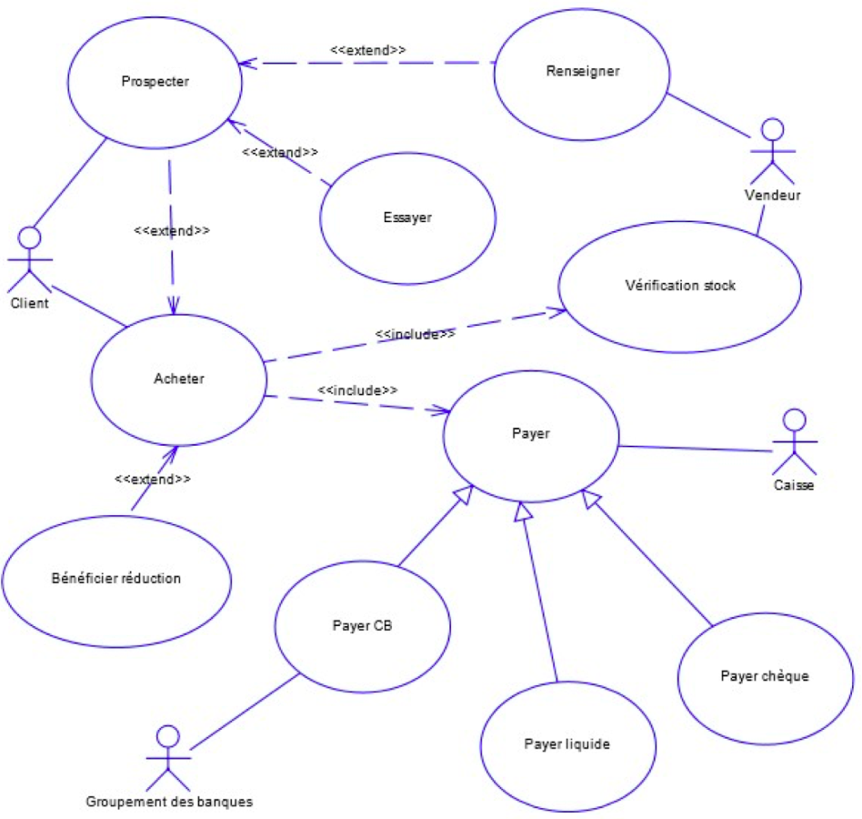
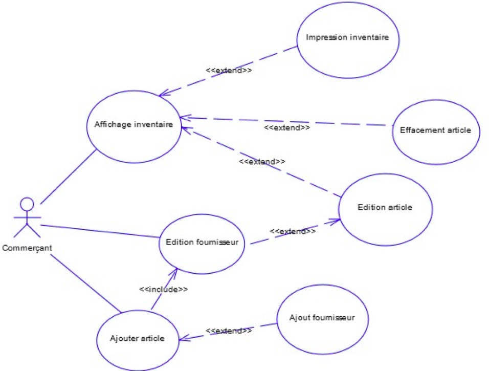

# ANA3 TP3

## Exercice 1: Identifier les acteurs

---
### 1.
Un client se sert de boisson de la façon suivante : il met une pièce dans le récupérateur de pièces, il sélectionne la boisson, il récupère la boisson choisie dans le bac à boissons et la monnaie en trop dans la trappe de monnaie. Qui est l'acteur du système ? Est-ce la boisson, le récupérateur de monnaie, le client, le bac à boissons ou la trappe de monnaie ?<br>
`C'est le client l'acteur 'Client'.`

---
### 2.
Marcel, dont le métier est approvisionneur de distributeurs, peut se servir de boissons. Pour modéliser cette activité de Marcel, doit-on définir un nouvel acteur ? Comment modélise-t-on ça ?<br>
`Client <--- < Generalisation > ---- Approvisionneur`<br>
`L'approvisionneur peut se comporter comme un client`

---
### 3.
Lorsque Marcel vient avec son clarque rempli de nouvelles boissons pour remplir le distributeur de boissons, est-il considéré comme un nouvel acteur ? Comment modélise-t-on cela ?<br>
`C'est l'acteur Approvisionneur.`

---
### 4.
Certains approvisionneurs sont aussi qualifiés pour effectuer des opérations de
maintenance en plus des opérations habituelles des approvisionneurs. Ils sont donc
réparateurs en plus d'être approvisionneur. Comment
modéliser cela ?<br>
`Un réparateur peut se comporter comme un Approvisionneur qui peut se comporter comme un Client.`


<p style="color: darkgray; text-align: center">Figure Exercice 1.</p>

---
## Exercice 2: Analyser acteur et domaine

---
### 1. Considérons un système de gestion de l’occupation des terrains, appelés courts, d’un club de tennis. Lequel de ces éléments n’est probablement pas un acteur ?
1. `Membre:` Un membre devra sans doute consulter son horaire de jeu.
2. `Instructeur:` L'instructeur devra sans doute réserver un terrain pour une leçon, ou bien consulter son horaire.
3. `Spectateur:` Un spectateur pourrait éventuellement consulter où se déroule le match qu'il veut regarder.
4. `Maintenance des courts:` La personne en charge de la maintenance des courts devra sans doute consulter le terrain qu'il doit gérer.
5. `Programmateur de compétition:` Il doit pouvoir gérer les terrains.

---
### 2. Considérons un système de gestion des courts d’un club de tennis. Lequel n’est probablement pas un cas d’utilisation ?
1. `Réserver un court:` Oui, c'est un cas d'utilisation.
2. `Réserver une leçon avec un instructeur:` Probablement, oui, sauf si réserver une leçon ne prend pas les courts en compte.
3. `Planifier la maintenance des courts:` Probablement, oui, sauf si planifier une maintenance ne prend pas les courts en compte.
4. `Programmer une compétition:` Probablement, oui, car on aimerait sans doute assigner une compétition à certain courts en particulier.
5. `Suivre une heure de leçon:` On a envie de dire non, sauf s'il est possible de consulter son horaire par exemple.

---
### 3. Considérons un système d’inscription et de suivi de patients dans une unité d’urgence d’un hôpital. Lequel de ces éléments n’est probablement pas un acteur ?
1. `Patient:` Ce n'est probablement pas un acteur, sauf si le patient peut s'enregistrer à une borne avant la consulation par exemple.
2. `Ambulancier:` Probablement, oui, car en général l'ambulancier prévient les urgences et déclare le type d'accident avant d'arriver.
3. `Système de gestion de dossier des patients:` Probablement, oui, car si un patient est déja connu dans l'hopital, le département des urgences devrait pouvoir récupérer ses informations.
4. `Docteur:` Probablement, oui, car il devra mettre à jour le dossier du patient avec des informations.
5. `Secrétaire:` Oui car c'est le secrétaire qui s'occupe des dossiers de tous les patients.

---
### 4. Pour le système précédent, laquelle de ces propositions n’est probablement pas un cas d’utilisation ?
1. `Inscrire un patient:` Probablement oui
2. `Attendre à la salle d'attente:` Sans doute que non! À moins qu'on doive prendre un ticket comme à la poste hihi blbl
3. `Faire une évaluation générale du patient:` Sans doute que l'on va entrer les résultats dans le dossier donc oui.
4. `Faire un examen général:` Pareil que point 3.
5. `Donner une ordonnance au patient:` Si la prescription est virtuelle alors oui. Si ce n'est qu'un bout de papier écrit à la main alors non.

---
## Exercice 3: Analyser un diagramme de cas d'utilisation


<p style="color: darkgray; text-align: center">Figure Exercice 3.</p>

> `A` ---- `< include >` ---> `B`<br>
> Si on exécute A alors B sera exécuté.
>
> `C` <--- `< extend >` ---- `D`<br>
> Si on exécute C, on n'est pas obligé d'exécuter D.

```
Un commerçant peut gérer ses stocks et ses magasins.

Il peut ajouter un article, éditer fournisseur ou ajouter fournisseur dans sa liste.

Il peut éditer un fournisseur.

Il peut afficher son inventaire, imprimer, effacer article, modifier article (modifier fournisseur associé à l'article).

by Glycine.
```

---
## Exercice 4. Reconnaître des composants sur un diagramme de cas d’utilisation


<p style="color: darkgray; text-align: center">Figure Exercice 4.</p>

```java
Public static void maint() {
    int x = 2;
}
```

```python
print("ok")
x = 34
```