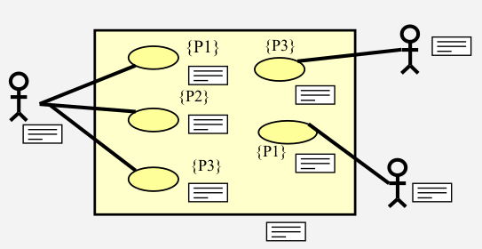

# ANL3

[Intro](#étapes-de-développement-d'un-logiciel:)

## Étapes de développement d'un logiciel:
```
- Préétude
    - Analyse
        - Conception
            - Réalisation
                - Tests
                    - Déploiement
```

<p style="color: darkgray; text-align: center">Structure</p>

---

## Plan des différents diagrammes
```
Conceptuel:
    - MCD
        |---Diagramme de classe
        |---Docu
    - MCT
        |---Use Cases
        |---Docu
Fonctionnel:
    - UC Specification
        |---Diagramme d'activités
    - PTFE
        |---Docu
Technique:
    - MTD MTT
        |---Diagramme de séquence
        |---Diagramme de classe technique
```
---

## MCD
> Modèle conceptuel de données

Contenu:

- Packages
- Classes + Relations


<p style="color: darkgray; text-align: center">Schéma MCD</p>

---

## MCT
> Modèle conceptuel de traitements

- Rôles et permissions
- Relations


<p style="color: darkgray; text-align: center">Schéma MCT</p>

---

### Use cases

> Cas d'utilisation

#### Objectifs:

- Définir les fonctionnalités du système
- Définir les limites précises du système


<p style="color: darkgray; text-align: center">Schéma Use Cases</p>

#### Specifications:

```
- Documentation étendue
- Diagrammes d'activités
- Tests
     - Description brève du use cases
     - Description détaillée
         - Conditions (pré et post)
         - Flux (base + alternatif)
         - Exigences
```